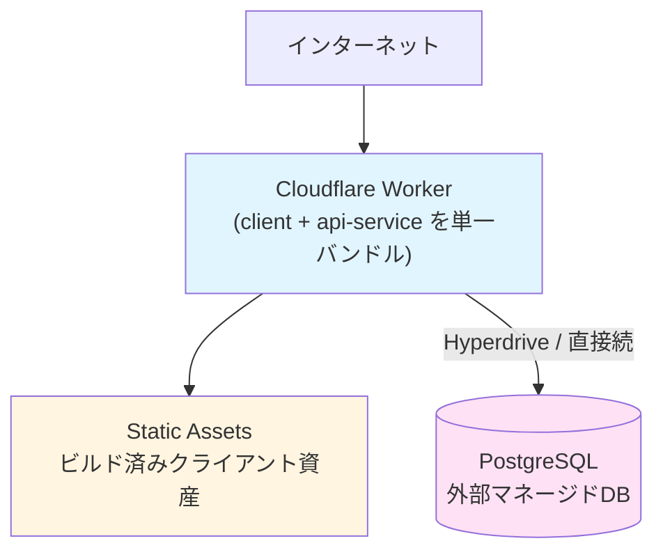
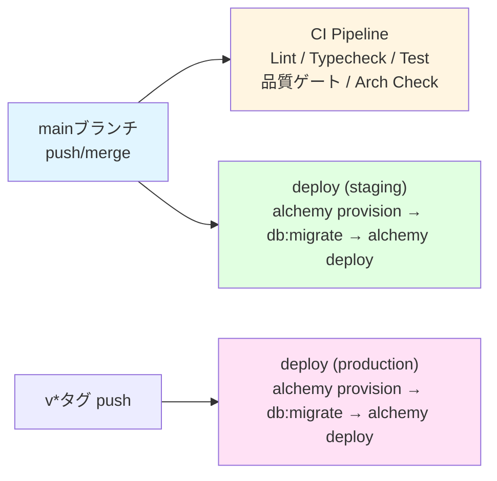
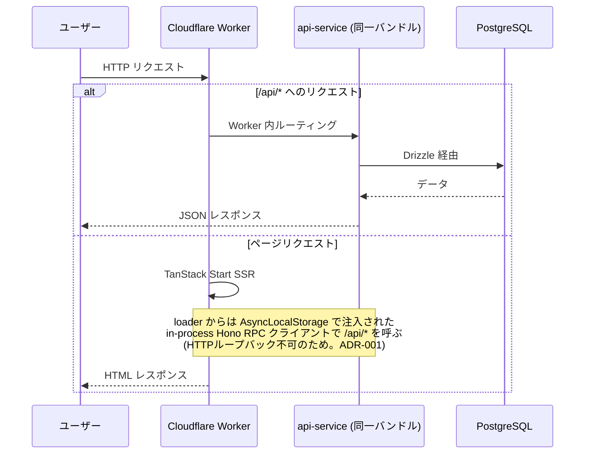

# システムアーキテクチャ

このドキュメントでは、本テンプレートのシステム全体のアーキテクチャ、リクエストの流れ、デプロイフローについて説明します。

## 全体構成

client（TanStack Start）と api-service（Hono）はモノレポ上は別アプリだが、
デプロイ単位は **単一の Cloudflare Worker**。client のサーバーエントリ
（`apps/client/app/server.ts`）が api-service の Hono アプリをインポートしてバンドルし、
`/api/*` へのリクエストを Worker 内でルーティングする。

## アプリケーション構成

### Client (`apps/client`)

- **役割**: TanStack Start アプリケーション（SSR + CSR）
- **技術スタック**: TanStack Start, React 19, Tailwind v4, shadcn/ui
- **アーキテクチャ**: FSD (Feature-Sliced Design) ライクな構成
  - `features` 間の直接参照は禁止（dependency-cruiser で強制）。共通コンポーネントは `shared` に昇格させる。
- **API 呼び出し**:
  - ブラウザ: 相対 URL の Hono RPC クライアント（`hc<AppType>("/")`）→ 同一 Worker の `/api/*` へ
  - SSR（loader / createServerFn）: CF Workers では同一オリジンへの `fetch()` が
    自分自身の fetch ハンドラーへループバックしないため（[ADR-001](adr-001-cf-workers-session-check.md)）、
    AsyncLocalStorage 経由で注入されるインプロセス Hono RPC クライアントで呼び出す
    （`apps/client/shared/lib/api-client.ts`）

### Server (`apps/api-service`)

- **役割**: REST API（Hono）。単体でも Bun で起動可能（`bun run dev`）
- **技術スタック**: Hono, Drizzle ORM, neverthrow（ROP）、クリーンアーキテクチャ
- **依存ルール**（dependency-cruiser + arch-guards で強制）:
  - **Domain層**: 外部ライブラリ（フレームワーク、DB、バリデーションライブラリ等）への依存禁止。Application層のDTOにも依存しない（純粋な値のみ）。
  - **Application層**: ユースケースの入出力（DTO）を定義。Domain層の純粋関数を利用してロジックを実行。
  - **Infrastructure層**: DB操作の実装（Drizzle）。エラーは `ResultAsync.fromPromise` でラップ。
  - **Integrations層**: `external/`（サードパーティSDKの薄いラッパー）と `composition/`（feature間連携アダプタ）に分離。
  - 型定義の共有は Hono RPC (`AppType`) 経由で行う。
- **ロギング**: `@repo/logging`（pino）。Workers ランタイムでは console ベースの
  Workers-safe stream、Bun 開発時は pino-pretty、Bun/Node 本番では stdout NDJSON。

詳細は [CLAUDE.md](../../CLAUDE.md) のアーキテクチャ節と [開発ガイド](../dev/development.md) を参照。

## データベース

- **PostgreSQL**（外部マネージドDB。標準は PlanetScale — [ADR-002](./adr-002-hyperdrive-config.md)。プレーンな Postgres として扱うため他のマネージド Postgres にも差し替え可能）
- **接続**: `DATABASE_URL`（本番は Workers Secret）。ローカルは Docker（`bun run db:up`）
- **マイグレーション**: drizzle-kit（`bun run db:generate` / `db:migrate`）

## デプロイフロー

- ワークフロー: `.github/workflows/deploy.yml`（デプロイ本体は Alchemy — `alchemy.run.ts`。
  PlanetScale DB / Role / Hyperdrive / Worker を IaC として reconcile する）
- 必要な GitHub Environment Secrets / Variables の一覧は
  [デプロイガイド](../deploy/cloudflare-workers.md)を参照（Cloudflare / PlanetScale / Alchemy / アプリの各シークレット）
- GitHub Environments（staging / production）の Variables に `SMOKE_BASE_URL` を設定すると、
  デプロイ直後に `/api/health` と `/` の smoke チェックが走る（未設定なら skip）
- アプリの環境変数・シークレットは `alchemy.run.ts` の `bindings` で管理
  （`apps/client/wrangler.jsonc` はローカル dev 専用）

詳細は [Cloudflare Workers デプロイガイド](../deploy/cloudflare-workers.md) を参照してください。

## データフロー

### ユーザーリクエストの流れ

## 参照ドキュメント

- [開発ガイド](../dev/development.md) - 各アプリケーションの開発方法
- [Cloudflare Workers デプロイガイド](../deploy/cloudflare-workers.md) - デプロイの詳細手順
- [ADR-001: CF Workers でのセッション検証（SSR fetch 制約）](adr-001-cf-workers-session-check.md)
- [ドメインモデル指針](domain-model.md) - DMMFベースのコマンド/イベント/状態遷移の整理
