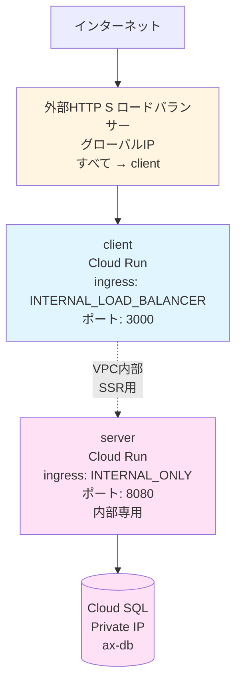
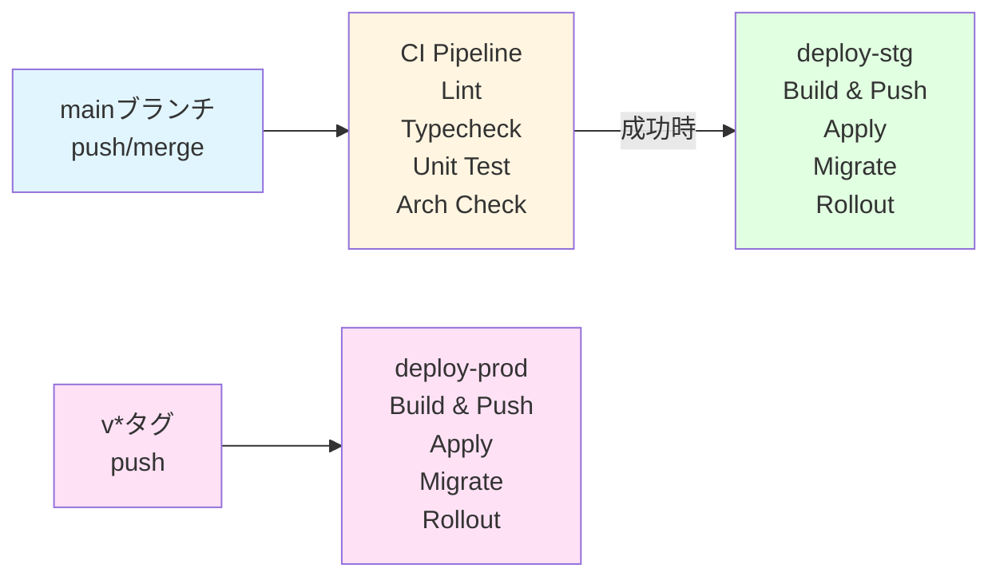
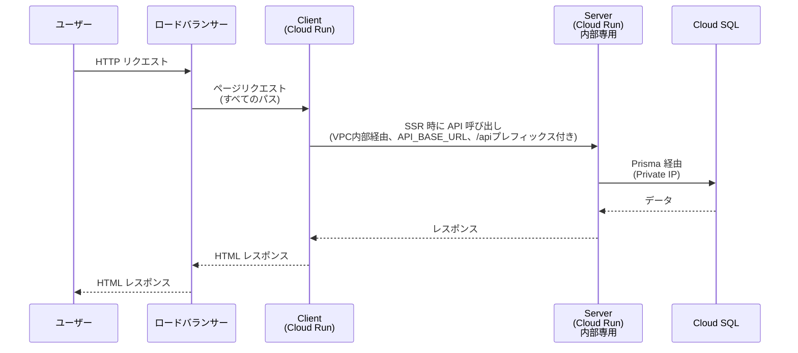

# システムアーキテクチャ

このドキュメントでは、ax-saas-template のシステム全体のアーキテクチャ、ネットワーク構成、デプロイフローについて説明します。

## 全体構成

## アプリケーション構成

### Client (`apps/client`)

- **役割**: Next.js アプリケーション（SSR）
- **技術スタック**: Next.js (App Router), React, Tailwind v4, shadcn/ui
- **アクセス**: ロードバランサー経由でのみアクセス可能（`INGRESS_TRAFFIC_INTERNAL_LOAD_BALANCER`）
- **API 呼び出し**: 内部通信のため、直接 Cloud Run の URL を使用（`API_BASE_URL` 環境変数）
- **アーキテクチャ**: FSD (Feature-Sliced Design) ライクな構成
  - `features` 間の直接参照は禁止されています。共通コンポーネントが必要な場合は `shared` に昇格させてください。

詳細は [Client 開発ガイド](../dev/development.md#client) を参照してください。

**デフォルト設定**:
- ポート: `3000`
- サービス名: `ax-client`（Cloud Run）
- ingress: `INGRESS_TRAFFIC_INTERNAL_LOAD_BALANCER`

### Server (`apps/api-service`)

- **役割**: REST API サーバー（Hono）
- **技術スタック**: Hono, Prisma, Result 指向（ROP）、クリーンアーキテクチャ
- **アクセス**: **内部専用**（VPC内部からのみアクセス可能）
  - Client (SSR) からのアクセス: VPC Connector経由（`ax-client-sa` で認証）
- **認証**:
  - Client SA: `ax-client-sa` に `run.invoker` 権限（SSR用）
  - **外部公開は行わない**（ロードバランサー経由のアクセスも不可）
- **ルータ**: RegExpRouter を採用
- **依存ルール**:
  - **Domain層**: 外部ライブラリ（フレームワーク、DB、バリデーションライブラリ等）への依存禁止。Application層のDTOにも依存しない（純粋な値のみ）。
  - **Application層**: ユースケースの入出力（DTO）を定義。Domain層の純粋関数を利用してロジックを実行。
  - **Infrastructure層**: DB操作や外部API呼び出しの実装。
  - **Integrations層**: 外部SDK（GCP等）の薄いラッパー。`@google-cloud/*` 等の外部ライブラリは必ずここに閉じ込める。
  - 型定義の共有は Hono RPC (`AppType`) 経由で行います（`@repo/contracts` は廃止）。

観測面では、`pinoLogger`（hono-pino）+ `@google-cloud/pino-logging-gcp-config` によりすべてのルートで Cloud Logging 準拠の構造化ログ（requestId / method / path / status / durationMs / severity / trace 等）が出力されます。本番環境では GCP 特殊フィールドが自動付与され、Cloud Error Reporting や Logs Explorer との連携が可能です。

詳細は [Server 開発ガイド](../dev/development.md#server) を参照してください。

**デフォルト設定**:
- ポート: `8080`
- サービス名: `ax-server`（Cloud Run）
- ingress: `INGRESS_TRAFFIC_INTERNAL`（内部専用）

## ネットワーク構成

### Cloud Run の ingress 設定

#### Client

- **ingress**: `INGRESS_TRAFFIC_INTERNAL_LOAD_BALANCER`
- **説明**: ロードバランサー経由でのみアクセス可能。直接の外部アクセスは不可。
- **IAM ポリシー**: `allUsers` に `run.invoker` 権限（ロードバランサー経由の公開アクセス用）

#### Server

- **ingress**: `INGRESS_TRAFFIC_INTERNAL_ONLY`
- **説明**: **内部専用**（VPC内部からのみアクセス可能）。外部からの直接アクセスは完全にブロック。
- **IAM ポリシー**:
  - `ax-client-sa`: Client (SSR) からのアクセス用（VPC内部経由）

### ロードバランサー構成

- **種類**: 外部 HTTP(S) ロードバランサー（Application Load Balancer）
- **ルーティング**:
  - すべてのパス → client バックエンド（server は内部専用のため公開しない）
- **IP**: グローバル静的IP（`ax-lb-ip`）
- **HTTPS**: オプション（`enable_ssl=true` で有効化、マネージド SSL 証明書）

**注意**: Serverは内部専用のため、ロードバランサー経由では公開されていません。Client側は `API_BASE_URL` で直接ServerのCloud Run URLを使用し、VPC内部経由でアクセスします。Client側は `shared/lib/api.ts` で Hono RPC クライアント (`hc<AppType>`) を使用し、サーバーの型定義から型安全性を確保しています。

詳細は [インフラ詳細](../infra/terraform/README.md#6-ネットワーク構成とロードバランサー) を参照してください。

### Cloud SQL

- **接続方式**: Private IP のみ（VPC 内）
- **接続**: Cloud Run は Serverless VPC Connector 経由で接続
- **認証**: Secret Manager の `database-url` を参照
- **デフォルト設定**:
  - インスタンス名: `ax-db`
  - データベース名: `app`
  - ユーザー名: `appuser`

## 認証・認可

### Client から Server へのアクセス認証

- Client は `ax-client-sa` サービスアカウントで実行されます
- Client から Server へのアクセスは、VPC内部経由（VPC Connector経由）で行われます
- Server は `ax-client-sa` に `run.invoker` 権限を付与しています
- Server の ingress 設定は `INGRESS_TRAFFIC_INTERNAL_ONLY` で、VPC内部からのアクセスのみ許可しています

## デプロイフロー

### CI/CD パイプライン

### デプロイステップ

#### 1. Build & Push

- コンテナイメージを buildx でビルド（server/client）
- Artifact Registry へ push（`latest` タグ）

#### 2. Apply

- Terraform を GCS Backend で `init` → `apply`
- Cloud Run の `image` はダイジェスト固定 → push 毎に `terraform apply` で差分検知して新 Revision へ
- 依存リソース作成更新 → Cloud SQL ユーザーのパスワードを Secret（GitHub Secrets 優先、なければ Secret Manager の database-url）に合わせて同期

#### 3. Migrate

- Cloud Run Job で `prisma migrate deploy` を実行
- `succeededCount/failedCount` と `completionTime` をポーリングして結果を判定

#### 4. Rollout

- migrate 成功時のみ、新しいリビジョンを作成（`BUILD_SHA` で差分を強制）

詳細は [デプロイガイド](../deploy/deployment.md) を参照してください。

## データフロー

### ユーザーリクエストの流れ

**注意**: Serverは内部専用のため、ロードバランサー経由では公開されていません。すべてのリクエストはClientにルーティングされ、ClientのSSR処理時にVPC内部経由でServerにアクセスします。

## 参照ドキュメント

- [開発ガイド](../dev/development.md) - 各アプリケーションの開発方法
- [デプロイガイド](../deploy/deployment.md) - デプロイの詳細手順
- [インフラ詳細](../infra/terraform/README.md) - Terraform の詳細とローカル実行方法
- [ドメインモデル指針](domain-model.md) - DMMFベースのコマンド/イベント/状態遷移の整理
