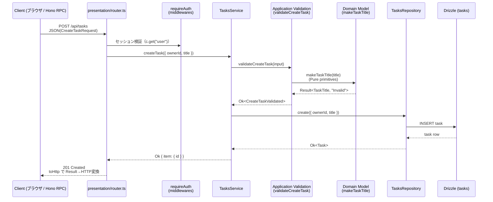

# ドメインモデル指針 (DMMF)

このドキュメントは、api-service の Presentation 層（`zValidator` スキーマ）と Application 層の DTO を軸に、主要コンテキストの状態遷移を整理したものです。DDDおよびDomain Model Management Framework(DMMF)の成果物として、実装・テスト・ドキュメント間のトレーサビリティを維持します。

## Tasks コンテキスト（正典実装）

- **集約**: タスク (`Task`)
- **主な状態**: `todo` → `in_progress` → `done`（`advance` で一方向に遷移）
- **識別子**: `id` (uuid, 永続化時に採番)、`ownerId` で認証ユーザーにスコープ

| 区分 | 型 | 説明 |
| --- | --- | --- |
| コマンド | `presentation/router.ts` → `CreateTaskRequestSchema` (zod) | タスク作成要求。Presentation層でzodバリデーション済みの入力を保持。 |
| ドメイン値 | `TaskTitle`（branded type, `makeTaskTitle`） | 不変条件（非空・200文字以内）を型で担保。 |
| クエリ応答 | `ListTasksResponse`（`application/list/mappers.ts`） | keyset ページネーション（`nextCursor`）付きの読み取りモデル。 |

### タスク作成フロー



作成成功時は `ActivityRecorder` ポート（`application/ports.ts`）経由で activity feature に
記録が委譲される（fail-open。詳細は `application/create/steps.ts` のコメント参照）。

### 状態遷移

```
(CreateTaskCommand) -> todo
todo -> (AdvanceTaskCommand) -> in_progress
in_progress -> (AdvanceTaskCommand) -> done
done -> (AdvanceTaskCommand) -> Err("AlreadyDone")
```

- コマンド処理でバリデーションエラーが発生した場合は `Result<_, "Invalid">` を返却し、状態遷移は行われない。
- インフラ層で一意制約違反（同一 owner + title）を検知した場合は `Result<_, "Conflict">` を返却する。
- 状態遷移の不変条件は DB の CHECK 制約（`tasks_status_check`）でも二重に強制される（ADR-004）。

## トレーサビリティ

| 成果物 | 参照先 | 目的 |
| --- | --- | --- |
| HTTP 契約 | `features/*/presentation/router.ts` の Zod スキーマ + `AppType`（Hono RPC） | ルート/クライアント間の入出力を統一。 |
| アプリケーション層 | `apps/api-service/src/features/**/application` | Resultチェインでコマンド処理を実装。DTO定義もここで行う。 |
| ドメイン層 | `apps/api-service/src/features/**/domain` | 不変条件と状態遷移を判定。**DTOには依存せず純粋な値を受け取る**。 |
| テスト | co-located `*.test.ts` + `apps/api-service/src/__tests__` | ユースケース/契約/統合テストでコマンド処理の流れを検証。 |

今後、新たなコマンド／イベントを追加する場合は、本ドキュメントと `router.ts` の Zod スキーマを同時に更新し、DMMF成果物として記録してください。
