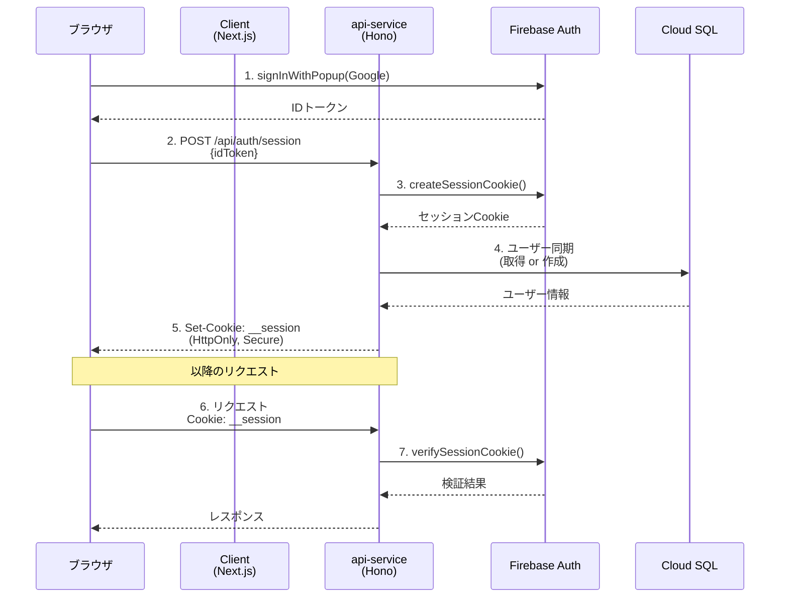
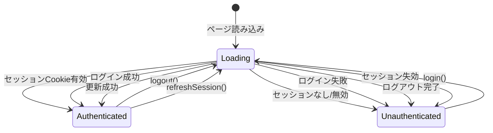

# 認証システム

このドキュメントでは、Google Identity Platform（Firebase Authentication）を使用した認証システムの設計、実装、および運用について説明します。

## 目次

- [アーキテクチャ概要](#アーキテクチャ概要)
- [Firebase公式推奨パターン](#firebase公式推奨パターン)
- [セットアップ手順](#セットアップ手順)
- [APIエンドポイント](#apiエンドポイント)
- [クライアント実装](#クライアント実装)
- [セキュリティ設計](#セキュリティ設計)
- [開発環境での動作確認](#開発環境での動作確認)
- [トラブルシューティング](#トラブルシューティング)

---

## アーキテクチャ概要

本システムでは、Google Identity Platform（Firebase Authentication）を使用してユーザー認証を行います。

### 全体構成



### コンポーネントの役割

| コンポーネント | 役割 |
|--------------|------|
| Firebase JS SDK | ブラウザでのGoogleログイン、IDトークン取得 |
| Firebase Admin SDK | サーバーでのセッションCookie生成・検証 |
| api-service | 認証エンドポイント、セッション管理 |
| Cloud SQL | ユーザー情報の永続化 |

---

## Firebase公式推奨パターン

本実装は[Firebase公式ドキュメント](https://firebase.google.com/docs/auth/admin/manage-cookies)で推奨されているセッションCookieパターンに準拠しています。

### なぜセッションCookieを使用するか

| 方式 | 特徴 | 本システムでの採用 |
|-----|------|------------------|
| IDトークン直接使用 | 短命（1時間）、クライアント側で自動更新が必要 | ❌ |
| セッションCookie | 長命（最大14日）、サーバー管理、HttpOnly保護 | ✅ |

### セッションCookieの利点

1. **強化されたセキュリティ**: サービスアカウントで署名されたJWTベースのトークン
2. **ステートレス**: IDトークンと同じクレームを含み、一貫した権限チェックが可能
3. **柔軟なCookieポリシー**: domain, path, secure, HttpOnly属性を制御可能
4. **失効機能**: セッション盗難の疑いがある場合に失効可能
5. **アカウント変更検出**: 重大なアカウント変更時にセッション失効を検出

---

## セットアップ手順

### 1. GCPでOAuthクライアントを作成

1. [Google Cloud Console](https://console.cloud.google.com/) にアクセス
2. **APIs & Services** → **Credentials** に移動
3. **CREATE CREDENTIALS** → **OAuth client ID** を選択
4. アプリケーションの種類: **Web application**
5. 承認済みの JavaScript 生成元を追加:
   - `http://localhost:3000`（開発用）
   - `https://your-domain.com`（本番用）
6. 承認済みのリダイレクト URI を追加:
   - `https://your-project.firebaseapp.com/__/auth/handler`
7. **Client ID** と **Client Secret** をメモ

### 2. Terraformで Identity Platform を有効化

```hcl
# terraform.tfvars
google_oauth_client_id     = "xxxxxxxxxxxx.apps.googleusercontent.com"
google_oauth_client_secret = "GOCSPX-xxxxxx"
```

```bash
cd infra/terraform
terraform apply
```

これにより以下が作成されます:
- Identity Platform API の有効化
- Google OAuth プロバイダーの設定
- 認可済みドメインの設定

### 3. クライアント側の環境変数

```bash
# apps/client/.env.local
NEXT_PUBLIC_FIREBASE_API_KEY=AIza...
NEXT_PUBLIC_FIREBASE_AUTH_DOMAIN=your-project.firebaseapp.com
NEXT_PUBLIC_FIREBASE_PROJECT_ID=your-project-id
API_BASE_URL=http://localhost:8080
```

**取得方法**:
1. [Firebase Console](https://console.firebase.google.com/) にアクセス
2. プロジェクト設定 → 全般 → マイアプリ → ウェブアプリを追加
3. Firebase SDK snippet から値をコピー

### 4. サーバー側の環境変数

```bash
# apps/api-service/.env
NODE_ENV=development
FIREBASE_PROJECT_ID=your-project-id
```

Cloud Run では Application Default Credentials (ADC) が自動的に使用されます。

---

## APIエンドポイント

### POST /api/auth/session

IDトークンからセッションCookieを生成します。

**リクエスト**:
```json
{
  "idToken": "eyJhbGciOiJSUzI1NiIs..."
}
```

**レスポンス** (200 OK):
```json
{
  "user": {
    "id": 1,
    "firebaseUid": "abc123...",
    "email": "user@example.com",
    "name": "ユーザー名"
  },
  "isNewUser": false
}
```

**Set-Cookie**:
```
__session=eyJhbGciOiJSUzI1NiIs...; Path=/; HttpOnly; Secure; SameSite=Lax; Max-Age=432000
```

**エラーレスポンス**:
- `400 Bad Request`: idToken が不正
- `401 Unauthorized`: IDトークンの検証失敗

---

### GET /api/auth/me

現在のセッション情報を取得します。

**リクエスト**: Cookie: `__session=...`

**レスポンス** (200 OK):
```json
{
  "user": {
    "id": 1,
    "firebaseUid": "abc123...",
    "email": "user@example.com",
    "name": "ユーザー名"
  },
  "isNewUser": false
}
```

**エラーレスポンス**:
- `401 Unauthorized`: セッションが無効または期限切れ
- `403 Forbidden`: ユーザーが無効化されている

---

### POST /api/auth/logout

セッションを終了します。

**リクエスト**:
```json
{
  "revokeAllSessions": false
}
```

| パラメータ | 型 | 説明 |
|-----------|---|------|
| `revokeAllSessions` | boolean | `true` の場合、すべてのデバイスからログアウト |

**レスポンス** (200 OK):
```json
{
  "success": true
}
```

---

## クライアント実装

### AuthProvider の使用

```tsx
// app/layout.tsx
import { AuthProvider } from "@/features/auth";

export default function RootLayout({ children }) {
  return (
    <html lang="ja">
      <body>
        <AuthProvider>{children}</AuthProvider>
      </body>
    </html>
  );
}
```

### useAuthContext フック

```tsx
import { useAuthContext } from "@/features/auth";

function MyComponent() {
  const {
    firebaseUser,  // Firebase ユーザー（ブラウザ側）
    appUser,       // アプリユーザー（DB）
    loading,       // 読み込み中フラグ
    error,         // エラーメッセージ
    login,         // ログイン関数
    logout,        // ログアウト関数
    refreshSession // セッション更新関数
  } = useAuthContext();

  if (loading) return <p>読み込み中...</p>;
  if (!appUser) return <LoginButton />;

  return (
    <div>
      <p>ようこそ、{appUser.name}さん</p>
      <button onClick={() => logout()}>ログアウト</button>
    </div>
  );
}
```

### 認証状態のライフサイクル



---

## セキュリティ設計

### Cookie 属性

| 属性 | 値 | 目的 |
|-----|---|------|
| `HttpOnly` | `true` | XSS攻撃からの保護（JavaScriptからアクセス不可） |
| `Secure` | `true`（本番） | HTTPS通信のみで送信 |
| `SameSite` | `Lax` | CSRF攻撃の軽減 |
| `Path` | `/` | すべてのパスで有効 |
| `Max-Age` | `432000`（5日） | セッション有効期限 |

### セッション検証

```typescript
// 検証フロー
const result = await verifySessionCookie(sessionCookie, true);
// checkRevoked=true で以下をチェック:
// - トークンの署名
// - トークンの有効期限
// - ユーザーの無効化状態
// - セッションの失効状態
```

### エラーコード

| コード | 意味 | 対応 |
|-------|------|------|
| `auth/session-cookie-expired` | セッション期限切れ | 再ログインを促す |
| `auth/session-cookie-revoked` | セッションが失効済み | 再ログインを促す |
| `auth/user-disabled` | ユーザーが無効化 | アクセス拒否 |

### キャッシュ制御

認証が必要なルートでは、キャッシュを無効化してデータ漏洩を防止します:

```typescript
// 保護ルートに適用されるミドルウェア
c.header("Cache-Control", "private, no-store, no-cache, must-revalidate");
c.header("Pragma", "no-cache");
```

---

## 開発環境での動作確認

### 1. Firebase エミュレータなしでの開発

本番と同じ Firebase Authentication を使用する場合:

```bash
# api-service を起動
cd apps/api-service
bun run dev

# client を起動
cd apps/client
bun run dev
```

### 2. 動作確認手順

1. `http://localhost:3000/login` にアクセス
2. 「Googleでログイン」をクリック
3. Google アカウントでログイン
4. `/dashboard` にリダイレクトされることを確認
5. ブラウザの開発者ツールで `__session` Cookieが設定されていることを確認

---

## トラブルシューティング

### ログインボタンをクリックしても何も起きない

**原因**: Firebase の設定が不正

**確認事項**:
1. 環境変数が正しく設定されているか
2. GCP Console で承認済みドメインに `localhost` が含まれているか
3. ブラウザのコンソールにエラーが出ていないか

### セッションCookieが設定されない

**原因**: CORS または Cookie 設定の問題

**確認事項**:
1. `credentials: "include"` が fetch リクエストに含まれているか
2. api-service が正しい CORS ヘッダーを返しているか
3. `Secure` 属性が本番環境でのみ有効になっているか

### 「Session revoked」エラー

**原因**: セッションが失効している

**対応**:
1. ユーザーに再ログインを促す
2. Firebase Console でユーザーのセッションが失効されていないか確認

### 「User disabled」エラー

**原因**: Firebase Console でユーザーが無効化されている

**対応**:
1. Firebase Console でユーザーの状態を確認
2. 必要に応じてユーザーを有効化

### Application Default Credentials エラー（ローカル開発）

**原因**: GCP 認証情報が設定されていない

**対応**:
```bash
gcloud auth application-default login
```

---

## 参照ドキュメント

- [Firebase公式: セッションCookieの管理](https://firebase.google.com/docs/auth/admin/manage-cookies)
- [Firebase公式: IDトークンの検証](https://firebase.google.com/docs/auth/admin/verify-id-tokens)
- [Google Identity Platform](https://cloud.google.com/identity-platform/docs)
- [アーキテクチャ概要](../architecture/architecture.md)
- [インフラ構成](../architecture/infrastructure.md)
